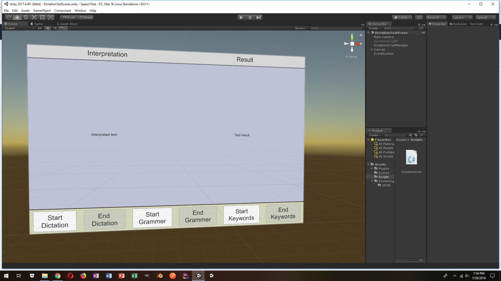

The **_SpeechTest_** project is a fairly simple UNITY project with a UI that allows the user to select from one (Windows Speech) service at a time. 

Speech is captured and then converted to Text for display to the user. 

**Requirements:**
Dictation and Grammer Modes require Win10 Fall Creators Edition update.

